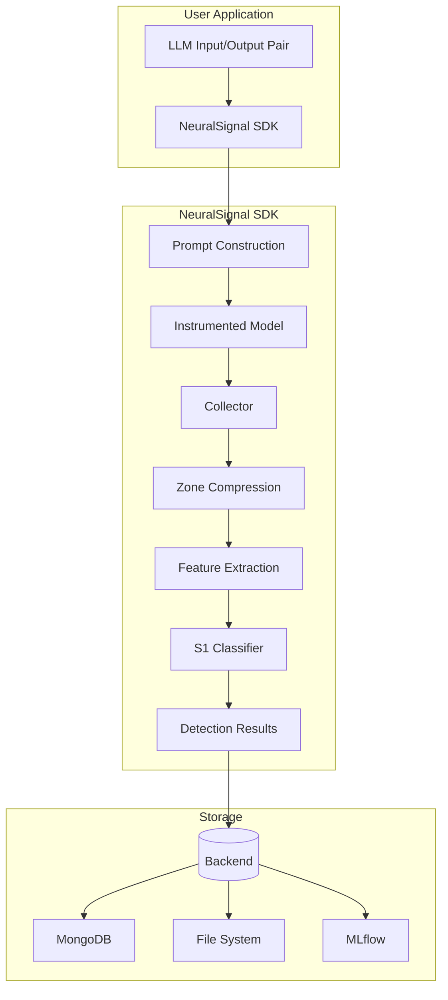
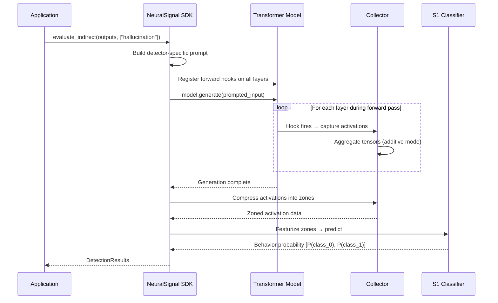
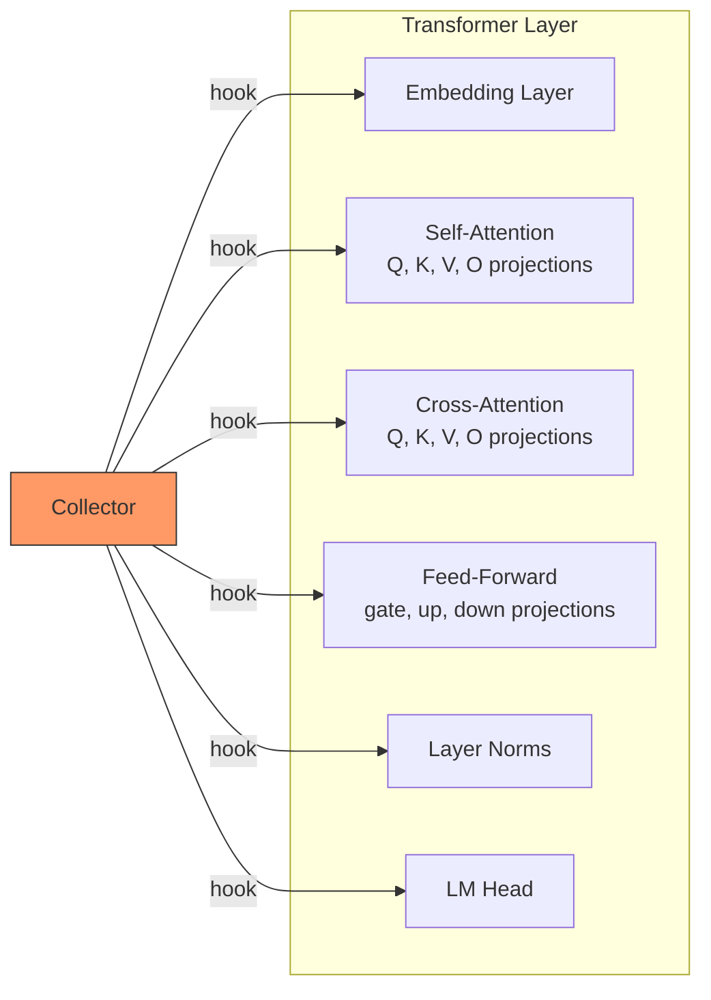
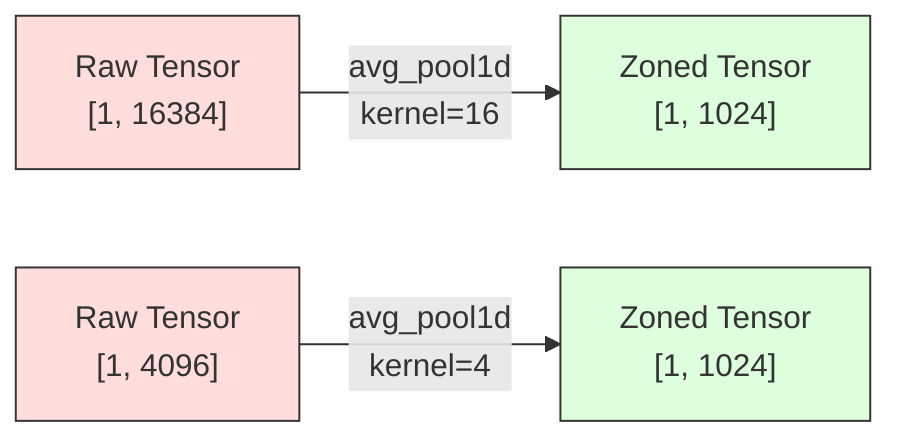
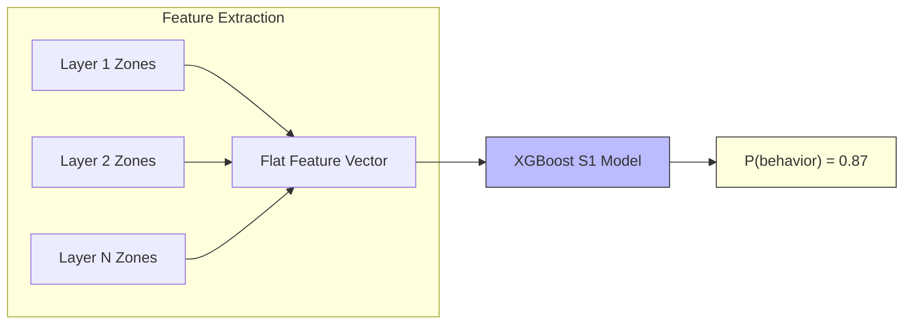
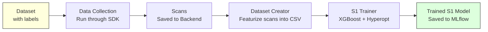

# NeuralSignal

**Detect behavioral anomalies in Large Language Model outputs through real-time model instrumentation.**

NeuralSignal is a Python SDK that instruments transformer models at the layer level, captures internal activation patterns during inference, and uses trained classifiers (called **S1 models**) to detect behaviors such as hallucination, toxicity, bias, and identity attacks — without relying on the model's text output alone.

---

## How It Works

NeuralSignal operates on a simple but powerful idea: **an LLM's internal activations reveal more about its behavior than its text output alone**. By attaching hooks to every layer of a transformer model and analyzing the resulting activation patterns, NeuralSignal can classify whether a generation exhibits specific behaviors.

### Architecture Overview



### The Instrumentation Pipeline

The core innovation is the **instrumentation pipeline** — a process that intercepts and records the internal computations of a transformer model as it processes input.



### Step 1: Model Instrumentation

NeuralSignal uses [PyTorch forward hooks](https://pytorch.org/docs/stable/generated/torch.nn.Module.register_forward_hook.html) to intercept the input and output tensors of every layer in the model during a forward pass. This is non-destructive — the model's behavior is unchanged, but its internal state is recorded.

For each supported architecture, hooks are attached to specific components:



**Supported model architectures:**

| Architecture | Models | Type |
|---|---|---|
| T5 | T5, FLAN-T5 | Encoder-Decoder |
| LLaMA | LLaMA 2, JudgeLM | Causal LM |
| Mistral | Mistral-7B | Causal LM |
| Mixtral | Mixtral-8x7B | Mixture of Experts |
| Phi | Phi-3 | Causal LM |
| BERT | BERT | Masked LM |
| DeBERTa | DeBERTa | Masked LM |
| MPNet | MPNet | Masked LM |

### Step 2: Activation Collection

The `Collector` class acts as the hook callback. Each time a hook fires, the Collector:

1. **Captures** the input and output tensors of that layer
2. **Aggregates** them using additive mode — if the same layer fires multiple times (e.g., during autoregressive decoding), the tensors are summed together
3. **Tracks** layer metadata: execution order, layer names, and pass counts

This produces a complete "scan" — a snapshot of the model's internal state for a given input.

### Step 3: Zone Compression

Raw activation tensors are high-dimensional. NeuralSignal compresses them into fixed-size **zones** using average pooling (`torch.nn.functional.avg_pool1d`). A zone size of 1024 means each layer's activation tensor is reduced to a 1024-dimensional vector regardless of the original size.



Zone sizes can be configured globally or per-layer, and layers can be selectively included or excluded.

### Step 4: Feature Extraction & Classification

The zoned activations are converted into a flat feature vector and fed into an **S1 model** — an XGBoost binary classifier trained to detect a specific behavior. Each detector has its own S1 model, its own prompt template, and its own classification threshold.



Available feature extraction strategies:
- **Zones** — Pooled activation values per layer
- **Tuned Lens** — Intermediate logit-space projections
- **Logit Lens** — Direct logit-space analysis
- **Layer Distributions** — Statistical distribution of activation values
- **Delta Features** — Differences between input and output activations

### Step 5: Detection

The S1 model outputs a probability for each class. The result is returned as a `DetectionResults` object containing the behavior name, probability score, and optional threshold-based binary judgment.

---

## Indirect vs Direct Evaluation

NeuralSignal supports two evaluation modes:

| Mode | How it works | Status |
|---|---|---|
| **Indirect** | Takes an existing LLM input/output pair, re-processes it through an instrumented "probe" model (e.g., FLAN-T5) with a behavior-specific prompt, and classifies the probe model's activations | Implemented |
| **Direct** | Wraps the actual generation call, instrumenting the production model in real-time | Planned |

In indirect mode, NeuralSignal doesn't need access to the original LLM. It uses a smaller instrumented model as a behavioral probe — the idea being that the probe model's internal activations when processing the original Q&A pair will reveal patterns indicative of the behavior being tested.

---

## Project Structure

```
neuralsignal/
├── sdk/
│   ├── neuralsignal.py              # SDK class — main entry point
│   └── neuralsignal_sdk.yaml        # Default configuration
├── core/
│   ├── modules/
│   │   ├── model_instrumentation.py # Hook registration per architecture
│   │   ├── collector.py             # Activation capture & aggregation
│   │   ├── detector.py              # Behavior detector (wraps S1 model)
│   │   ├── tensors.py               # Zone compression & featurization
│   │   ├── s1_model.py              # S1 classifier wrapper
│   │   ├── generation_instance.py   # Container for scan data
│   │   ├── prompting.py             # Prompt template engine
│   │   ├── neuralsignal_config.py   # Configuration management
│   │   └── feature_sets/            # Feature extraction strategies
│   │       ├── feature_set_zones.py
│   │       ├── feature_set_tuned_lens.py
│   │       └── feature_set_logit_lens.py
│   └── exceptions/
│       └── NSAbortLLM.py            # Early-stop exception
├── backend/
│   ├── ns_backend.py                # Backend abstraction
│   ├── mongo_backend.py             # MongoDB storage
│   ├── file_backend.py              # Pickle file storage
│   └── ns_be_impl_v1.py             # NeuralSignal native backend
├── datasets/
│   ├── dataset.py                   # HuggingFace dataset wrapper
│   ├── dataset_definitions.py       # Pre-configured datasets
│   ├── dataset_runner.py            # Batch data collection
│   ├── dataset_creator.py           # Build training CSVs from scans
│   └── s1_trainer.py                # XGBoost S1 model training
└── automation/
    ├── dataset_automation_core.py   # End-to-end pipeline orchestration
    └── *.yaml                       # Pipeline configurations
```

---

## Quick Start

### Installation

```bash
pip install torch transformers datasets pymongo bitsandbytes mlflow xgboost hyperopt scikit-learn pandas pygments pyyaml
```

### Basic Usage — Detect Hallucinations

```python
from neuralsignal.sdk.neuralsignal import SDK

# Initialize the SDK
sdk = SDK(
    application_name="my_app",
    sub_application_name="hallucination_check"
)

# Define LLM outputs to evaluate
outputs = [
    {
        "input": "What is the capital of France?",
        "output": "The capital of France is Berlin.",
        "context": "France is a country in Western Europe. Its capital is Paris.",
    }
]

# Run hallucination detection
results = sdk.evaluate_indirect(outputs, ["hallucination"])

# Inspect results
for result in results:
    for detection in result.detections:
        print(f"Behavior: {detection.behavior_name}")
        print(f"Score: {detection.score}")
```

### Using Detector Objects Directly

```python
from neuralsignal.sdk.neuralsignal import SDK
from neuralsignal.core.modules.detector import Detector

sdk = SDK(
    application_name="my_app",
    sub_application_name="multi_check"
)

# Build detector objects with custom configuration
detectors = [
    Detector({
        "behavior_name": "hallucination",
        "S1_model_path": "runs:/your_model_run_id/S1",
        "prompt": "Is this answer correct? Question: {input} Answer: {output} Context: {context}",
        "enabled": True,
        "application_name": "my_app",
        "sub_application_name": "multi_check",
    })
]

outputs = [{"input": "...", "output": "...", "context": "..."}]
results = sdk.evaluate_indirect_output(outputs, detectors)
```

### Custom Configuration

```python
sdk = SDK(
    application_name="my_app",
    sub_application_name="my_subapp",
    config={
        "evaluation_mode": "indirect",
        "save_scans": False,
        "max_new_tokens": 1,
        "indirect_config": {
            "indirect_model": "google/flan-t5-large",
            "quantization": "int8",  # Use 8-bit quantization to save VRAM
            "device": "auto",
        },
    }
)
```

---

## Training Your Own S1 Models

The full pipeline to train a behavior detector:



### 1. Collect Scans

```python
from neuralsignal.datasets.dataset_runner import DatasetRunner

runner = DatasetRunner(config={
    "application_name": "training",
    "sub_application_name": "hallucination_v1",
    "dataset_name": "halubench",
    # ... additional config
})
runner.run()
```

### 2. Create Training Dataset

```python
from neuralsignal.datasets.dataset_creator import DatasetCreator

creator = DatasetCreator(config={
    "application_name": "training",
    "sub_application_name": "hallucination_v1",
    # feature set configuration
})
creator.create_dataset()
```

### 3. Train S1 Model

```python
from neuralsignal.datasets.s1_trainer import S1Trainer

trainer = S1Trainer({
    "application_name": "training",
    "sub_application_name": "hallucination_v1",
    "model_name": "hallucination_detector_v1",
    "dataset_path": "path/to/training_data.csv",
    "optimization_metric": "auc",
    "max_evals": 50,
    "device": "cuda",
})
model = trainer.train_model()
```

The trainer uses **Hyperopt** for Bayesian hyperparameter optimization over XGBoost parameters (`max_depth`, `reg_lambda`, `max_bin`, `n_estimators`) and reports accuracy, AUC, F1, precision, recall, and log loss on both train and test splits.

---

## Configuration Reference

The SDK is configured via `neuralsignal_sdk.yaml`. Key settings:

| Setting | Description | Default |
|---|---|---|
| `evaluation_mode` | `indirect` or `direct` | `indirect` |
| `indirect_config.indirect_model` | HuggingFace model used as the probe | `google/flan-t5-large` |
| `indirect_config.quantization` | `no_quantization`, `int8`, or `int4` | `no_quantization` |
| `indirect_config.device` | PyTorch device | `auto` |
| `max_new_tokens` | Max tokens to generate during probe | `1` |
| `save_scans` | Persist scans to backend | `True` |
| `use_dynamic_batch_size` | Auto-reduce batch size on OOM | `True` |
| `max_oom_count` | OOM retries before SDK disables itself | `20` |
| `zone_size` | Default activation compression size | `1024` |
| `backend_config.backend_type` | `neuralsignal_v1`, `mongo`, or `file` | `neuralsignal_v1` |

---

## Requirements

- Python 3.10+
- PyTorch
- Transformers (HuggingFace)
- XGBoost
- scikit-learn
- Hyperopt
- pandas
- PyYAML
- pymongo (for MongoDB backend)
- bitsandbytes (for quantization)
- MLflow (for model tracking)

---

## License

See [LICENSE](LICENSE) for details.

## v2 Remote Secrets

NeuralSignal v2 uses secrets for Hugging Face dataset access, RunPod pod orchestration, S3 handoff storage, local MinIO, and optional authenticated MLflow. Keep these values out of committed YAML, manifests, logs, and MLflow params.

Local-only secret:

```text
RUNPOD_API_KEY
```

`RUNPOD_API_KEY` is used by the local CLI to create, inspect, and terminate RunPod pods. It must not be forwarded into the pod.

Secrets forwarded to RunPod through ignored `runpod.secrets` or `.env.runpod`:

```text
HF_TOKEN
AWS_ACCESS_KEY_ID
AWS_SECRET_ACCESS_KEY
AWS_SESSION_TOKEN
AWS_DEFAULT_REGION
NEURALSIGNAL_S3_BUCKET
NEURALSIGNAL_S3_ENDPOINT_URL
```

`HF_TOKEN` is required for gated Hugging Face datasets such as `metr-evals/malt-transcripts-public`. The AWS values are the scoped credentials created by `infra/terraform/s3-handoff` for uploading feature shards and metadata under `feature-runs/`.

Local MinIO and MLflow secrets:

```text
MINIO_ACCESS_KEY
MINIO_SECRET_KEY
MLFLOW_TRACKING_URI
MLFLOW_TRACKING_USERNAME
MLFLOW_TRACKING_PASSWORD
```

Local S1 training reads curated feature datasets from local disk or local MinIO and logs trained S1 models, metrics, configs, and dataset provenance to local MLflow. See `specs/required-secrets.md` for the full contract.
## v2 RunPod Lifecycle

Build and push the RunPod image:

```powershell
.\scripts\build_runpod_image.ps1 -Image ghcr.io/amperie/neuralsignal-runpod-base:latest -Push
```

Create the S3 handoff bucket and scoped RunPod credentials:

```powershell
cd infra\terraform\s3-handoff
terraform init
terraform apply
terraform output runpod_secret_values
terraform output -raw runpod_secret_access_key
```

Put local secrets in `.env` or `runpod.secrets`. The CLI loads `.env` locally and forwards only the secrets file into the pod. `RUNPOD_API_KEY` must stay local.

Run the full remote lifecycle:

```powershell
uv run ns remote collect configs\feature_collection\example_runpod_jsonl.yaml `
  --manifest configs\runpod_manifest.yaml `
  --run-id malt-smoke-001 `
  --secrets-file runpod.secrets `
  --target-dir runs\remote `
  --train-config configs\training\sabotage_s1.yaml `
  --minio-uri s3://neuralsignal-local/feature-datasets/malt-smoke-001
```

The local CLI launches RunPod, uploads the run config through the pod environment, waits until the S3 bundle and checksum exist, terminates the pod, downloads the bundle, deletes it from S3, unpacks it under the target directory, uploads the unpacked dataset/artifacts to MinIO when `--minio-uri` is set, and runs local S1 training when `--train-config` is provided. The MinIO dataset URI is logged to MLflow as `feature_dataset_uri`.